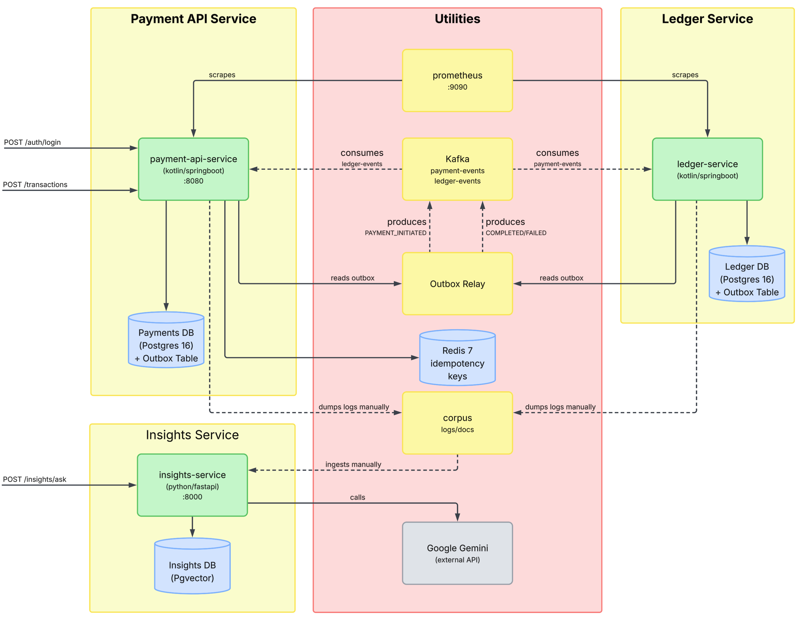
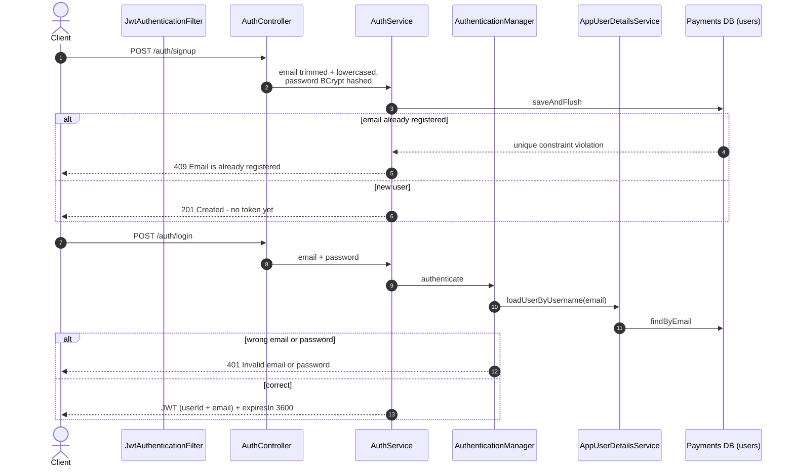
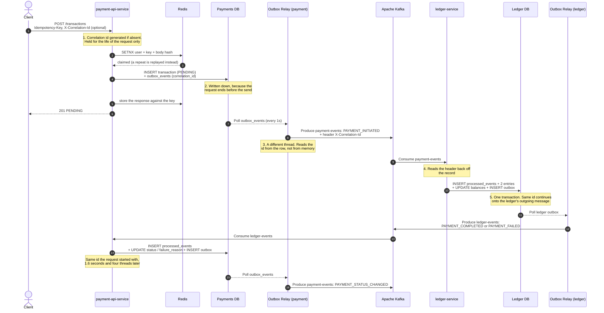
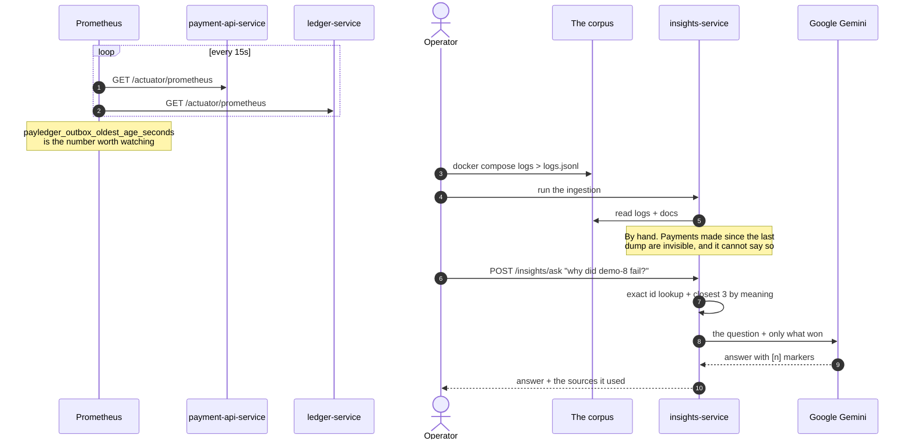

# System Design

What PayLedger is made of, how one payment moves through it, and what each service is responsible for.

## Component diagram

Every moving part of PayLedger, and what talks to what.

## Sequence diagrams
### Authentication

Every payments endpoint needs a token. Only `/auth/signup`, `/auth/login` and the health and metrics endpoints are open.

Signing up does not log you in, it returns the user, not a token, so the client has to call `/auth/login` afterwards in order to get a token.

### Payment flow

### Monitoring and insights

## Services
### 1. payment-api-service

This service records the intent, guarantees a double-click cannot become two charges, and answers `PENDING` straight away. It doesn't move money.

A payment is claimed in Redis before any work starts, on user + `Idempotency-Key` + a hash of the body. The same key with a different body is a `409`, not a second payment ([ADR-0002](decisions/0002-redis-backed-idempotency-keys.md)).

Failures split in two. A deterministic rejection is stored and replayed, so a retry gets back the same `400` it got the first time. Anything else, a dropped connection at commit, is ambiguous, and the key is held for 60s rather than released, because an exception is not proof that nothing was written.

If the payment commits but its idempotency record does not, the client still gets its receipt. A `500` there would report failure about money that has already moved.

Nothing is sent to Kafka inside the request. The controller writes an outbox row and a poller sends it a second later ([ADR-0004](decisions/0004-outbox-pattern-for-kafka-events.md)), so a broker outage delays an accepted payment instead of losing it.

### 2. ledger-service

No public API at all, the only way in is a Kafka message.

Everything commits together or not at all. `processed_events` is why the same message delivered twice only moves money once ([ADR-0005](decisions/0005-processed-events-for-consumer-idempotency.md)).

It has no user directory. An unknown account id means *not seen yet*, not invalid, so it opens a wallet at zero, and the payment that created it is then rejected for insufficient funds.

Three things reject a payment ([ADR-0009](decisions/0009-store-the-rejection-reason-as-opaque-text.md)):

- `CURRENCY_MISMATCH`
- `SELF_TRANSFER`
- `INSUFFICIENT_FUNDS`

All three still publish an event, a refusal is an answer, and the `payment-api-service` is holding a `PENDING` row waiting for one.

### 3. insights-service

Read-only. It searches first, and shows the model only what won.

It never searches one way. Identifiers in the question are pulled out with a pattern and looked up exactly against an indexed column, the question as a whole goes through semantic search for the closest 3, and the exact matches are listed first. The semantic half excludes anything the exact half already found, so no source is cited twice ([ADR-0017](decisions/0017-two-kinds-of-search-instead-of-one.md)).

The model is told to use the numbered sources only, to say plainly when they do not contain the answer, and for a failed payment to quote the real log lines and name the real rejection reason. `answer_service` is the only class that knows which provider is in use ([ADR-0018](decisions/0018-a-free-model-writes-the-answers.md)).

The two halves meet only at the `chunks` table, and both must use the same embedding model, numbers from one model mean nothing to another ([ADR-0016](decisions/0016-turn-text-into-numbers-on-this-machine.md)). An empty table answers `200` with "Nothing has been ingested yet"