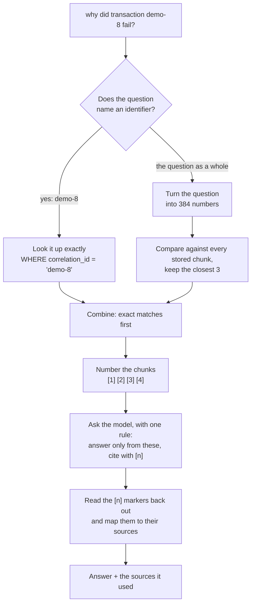

# Insights retrieval

How a question in plain English becomes an answer drawn from this project's own logs and documents.

This is the companion to [observability.md](observability.md). That one answers *what happened to this payment* by hand, with `grep`. This one answers the same question by asking, and adds a second one — *why is the system built this way* — from the documents in this repository. The reasoning behind each choice is in [ADR-0014](../decisions/0014-python-for-the-insights-service.md) through [ADR-0018](../decisions/0018-a-free-model-writes-the-answers.md).

## The idea in one line

A language model can only answer from what it is shown, and everything will not fit. So the service searches first, and shows it only what won.

That is the whole technique. The searching is where nearly all the difficulty lives; asking the model is the easy part at the end.

## The words this needs

Nothing else in PayLedger uses these, so they are worth defining before the diagram.

**Turning text into numbers.** A small model reads a piece of text and produces a list of 384 numbers standing for what it says. Text about the same subject produces similar lists, even with no words in common. This is the only reason a search can find "why not pessimistic locking" inside a document that never uses the phrase.

**Distance.** Two lists are compared by how far apart they point, on a scale where 0 means identical and 2 means opposite. In practice anything under about 0.6 is a real match and anything above 0.8 is unrelated. Sorting by that distance and keeping the closest few *is* the search.

**A chunk.** One searchable piece of text, stored with its numbers. Everything is broken into chunks before being stored, because a whole document is too coarse to be a useful answer and a single line is too small to mean anything.

## The path of one question



Two searches run for every question, and either can come back empty. A question naming no identifier gets nothing from the exact lookup, which is the normal case for a design question.

## Why two searches and not one

Because a name has no meaning.

"Why optimistic locking?" can be found by comparing meanings — that is exactly what the numbers are for. But `demo-8` is a label. Turning it into numbers produces a list with no significance, and comparing it against `demo-7` measures how the two strings happen to be chopped up, not whether they are related.

The failure that causes is the quiet kind: ask about one payment, get a fluent and confident answer about a different one, with nothing wrong on the surface. So identifiers are pulled out of the question with a pattern and looked up exactly, against indexed columns, and only the rest goes through the meaning-based search. The full argument is in [ADR-0017](../decisions/0017-two-kinds-of-search-instead-of-one.md).

Every result records which of the two found it, so a silent collapse back to one search is visible rather than merely suspected.

## What is stored, and how it is broken up

121 chunks at the time of writing: 117 from documents, 4 from logs.

**Logs are grouped by correlation id.** One payment's whole journey across both services — four to six lines — becomes one chunk. The id is a natural boundary, and it is the right one: a chunk spanning two payments matches both questions and answers neither.

**Documents are split at their headings**, at both `##` and `####`. The second level matters for two reasons. The model that produces the numbers stops reading after roughly 190 English words and says nothing about it, so a long section would lose its tail invisibly. And the ADRs use `####` for *Option A / Option B / Option C*, so splitting there makes each alternative separately findable — "why not pessimistic locking" matches one option rather than competing with two others inside the same block.

Ten chunks still exceed the limit. The ingestion step prints a `!` line for each one, which is the only warning that part of a document is unsearchable.

## Re-ingesting

The logs only exist on the containers' output, and `docker compose down` loses them. So the corpus is a snapshot, taken by hand:

```bash
docker compose logs --no-log-prefix > insights-service/data/logs.jsonl
docker compose exec insights python -m app.ingestion.ingestion_cli
```

`--no-log-prefix` is not optional. Without it Docker puts `ledger-1  | ` in front of every line and none of it parses.

Ingestion empties the table and rebuilds it from scratch each time. Nothing triggers it, so **payments made after the last dump are invisible, and the service cannot tell you that**. If an answer about a recent payment looks wrong, check the ingest date before anything else.

## Debugging a bad answer

Work bottom-up. A wrong answer is usually a retrieval problem wearing an answer's clothing, and looking at the prompt first wastes the afternoon.

**Look at what the search returned**, with the distances:

```bash
cd insights-service
./venv/bin/python -c "
from app.main import ApplicationContext
for hit in ApplicationContext().retrieval_service.retrieve_relevant_chunks('why did you choose the outbox pattern?'):
    print(hit.search_strategy.value, hit.distance, hit.source_ref)
"
```

A healthy result looks like this — the right document three times, with distances that separate clearly:

```
SEMANTIC  0.574  docs/decisions/0004-outbox-pattern-for-kafka-events.md — Alternatives considered / Option A
SEMANTIC  0.629  docs/decisions/0004-outbox-pattern-for-kafka-events.md — ADR-0004: ...
SEMANTIC  0.678  docs/decisions/0004-outbox-pattern-for-kafka-events.md — Alternatives considered / Option B
```

Everything bunched near 0.7 with no clear winner means there is no signal, and the chunking is the thing to change. A question about a specific payment coming back with no `EXACT` line means identifier matching is not firing, and the answer is about to be confidently wrong.

**Then check the score.** `eval/questions.json` holds ten questions and the source each should find:

```bash
./venv/bin/python -m app.retrieval.evaluation_cli
```

That number is the only way to tell whether a change to chunking or to the model helped or hurt. Without it, judging retrieval means comparing impressions of output nobody can hold in their head.

## What is deliberately not here

- **No automatic ingestion.** Nothing watches for new payments or edited documents. Re-running it is a manual step, and the service will happily answer from a stale corpus without mentioning it.
- **No enforced citations.** The `[n]` markers are the model's own claims about where something came from. It can attribute a sentence to source 2 that source 2 does not support, and the answer will look identical to a correct one. Reading the source alongside the answer is the only check. See [ADR-0018](../decisions/0018-a-free-model-writes-the-answers.md).
- **No login on the endpoint**, unlike every payments endpoint. Acceptable only because it is local and there is nothing sensitive behind it.
- **No index on the stored numbers.** At a thousand chunks, checking every row is faster than maintaining one. That stops being true somewhere around a million ([ADR-0015](../decisions/0015-search-in-postgres-rather-than-a-dedicated-search-database.md)).
- **No re-ranking, and no keyword scoring blended with the meaning-based search.** Both are standard next steps, and both are unnecessary at this size.
