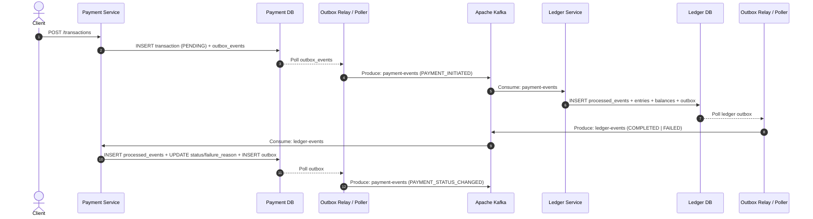

```mermaid
sequenceDiagram
    autonumber
    actor Client
    participant PayAPI as Payment Service
    participant PayDB as Payment DB
    participant Poller1 as Outbox Relay / Poller
    participant Kafka as Apache Kafka
    participant Ledger as Ledger Service
    participant LedgerDB as Ledger DB
    participant Poller2 as Outbox Relay / Poller

    Client->>PayAPI: POST /transactions
    PayAPI->>PayDB: INSERT transaction (PENDING) + outbox_events
    PayDB-->>Poller1: Poll outbox_events
    Poller1->>Kafka: Produce: payment-events (PAYMENT_INITIATED)

    Kafka->>Ledger: Consume: payment-events
    Ledger->>LedgerDB: INSERT processed_events + entries + balances + outbox
    LedgerDB-->>Poller2: Poll ledger outbox
    Poller2->>Kafka: Produce: ledger-events (COMPLETED | FAILED)

    Kafka->>PayAPI: Consume: ledger-events
    PayAPI->>PayDB: INSERT processed_events + UPDATE status/failure_reason + INSERT outbox
    PayDB-->>Poller1: Poll outbox
    Poller1->>Kafka: Produce: payment-events (PAYMENT_STATUS_CHANGED)
```
