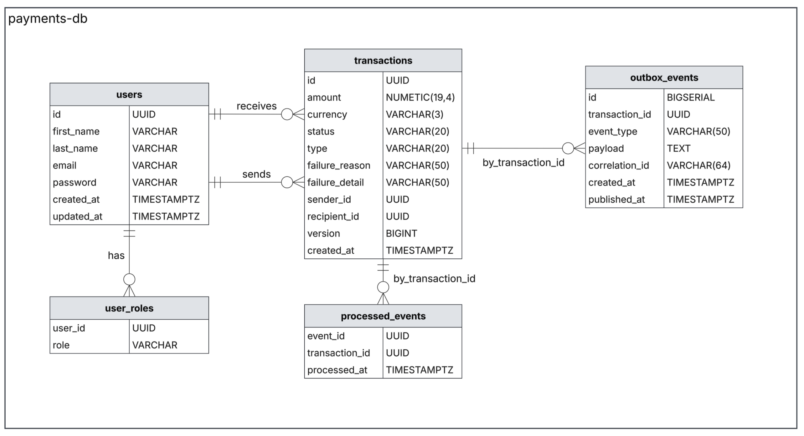
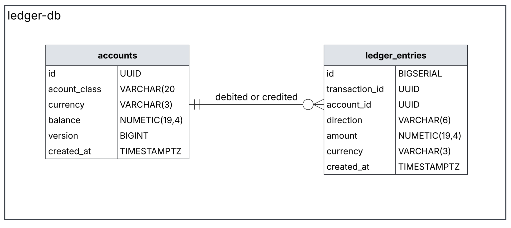
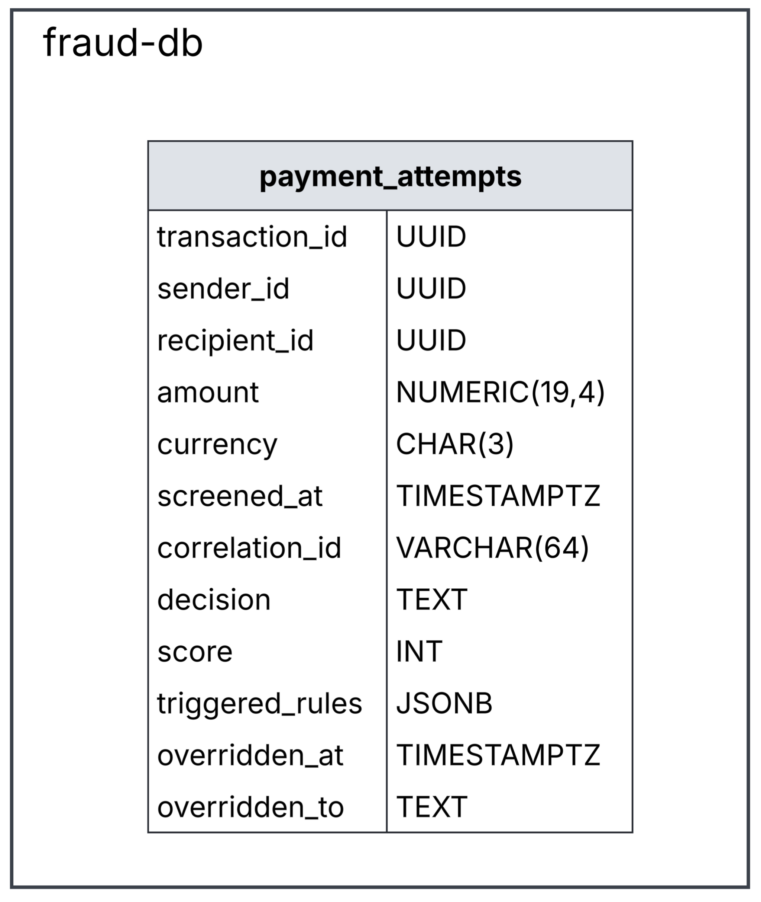
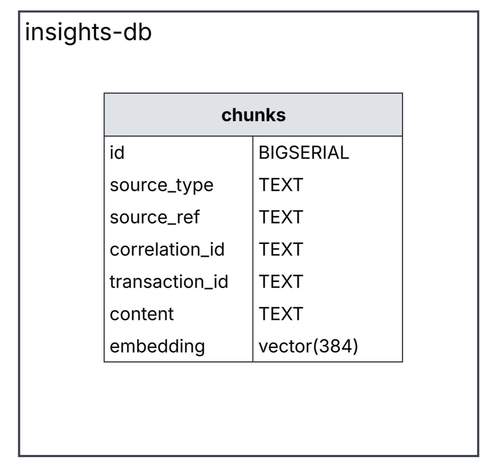

# Databases

What is stored, where, and which constraints are doing real work.

Four separate stores. Nothing reaches across them: there are no foreign keys between databases, and no service reads another service's tables. Schemas are versioned with Flyway and `ddl-auto` is off, so nothing is created automatically.

| Store | Port | Owned by | Holds |
|---|---|---|---|
| `payments-db` | 5432 | payment-api-service | users, transactions, its outbox |
| `ledger-db` | 5433 | ledger-service | accounts, entries, its outbox |
| `insights-db` | 5434 | insights-service | searchable chunks + embeddings |
| Redis | 6379 | payment-api-service | idempotency keys only |

## payments-db


`outbox_events` and `processed_events` carry a `transaction_id` but no foreign key, they are written and read by id

**users**

| Column | Type | Notes |
|---|---|---|
| `id` | UUID | primary key |
| `first_name`, `last_name` | VARCHAR | |
| `email` | VARCHAR | unique, stored lowercased and trimmed |
| `password` | VARCHAR | BCrypt hash, never the password |
| `created_at`, `updated_at` | TIMESTAMPTZ | |

---
**user_roles** — `(user_id, role)` as the primary key, so a role cannot be granted twice. Deleting a user cascades.

| Column  | Type    | Notes                                |
| ------- | ------- | ------------------------------------ |
| user_id | UUID    | `(user_id, role)` as the primary key |
| role    | VARCHAR | `(user_id, role)` as the primary key |

---
**transactions**

| Column                      | Type          | Notes                                                                                         |
| --------------------------- | ------------- | --------------------------------------------------------------------------------------------- |
| `id`                        | UUID          | primary key                                                                                   |
| `amount`                    | NUMERIC(19,4) | never a float                                                                                 |
| `currency`                  | VARCHAR(3)    |                                                                                               |
| `status`                    | VARCHAR(20)   | `PENDING`, `UNDER_REVIEW`, `COMPLETED`, `FAILED`                                              |
| `type`                      | VARCHAR(20)   | `TRANSFER`, `DEPOSIT`, `WITHDRAWAL`                                                           |
| `failure_reason`            | VARCHAR(50)   | null unless the ledger refused it                                                             |
| `failure_detail`            | VARCHAR(255)  | the sentence that goes with it, set and cleared together with the reason                      |
| `sender_id`, `recipient_id` | UUID          | to `users`, `ON DELETE RESTRICT`. Nullable — see below                                        |
| `version`                   | BIGINT        | optimistic locking ([ADR-0001](decisions/0001-optimistic-locking-for-transaction-updates.md)) |
| `created_at`                | TIMESTAMPTZ   |                                                                                               |

Three things are enforced here rather than in code: a user with payments cannot be
deleted (`RESTRICT`), two settlements of the same row cannot interleave (`version`),
and the parties have to match the type.

That last one is a single check doing three jobs. A transfer needs both parties and
they must be different people; a deposit has no sender; a withdrawal has no
recipient. The empty side is the platform's own account, which lives in `ledger-db`
and has no row in `users` to point at:

```sql
CHECK (
       (type = 'TRANSFER'   AND sender_id IS NOT NULL AND recipient_id IS NOT NULL AND sender_id <> recipient_id)
    OR (type = 'DEPOSIT'    AND sender_id IS NULL     AND recipient_id IS NOT NULL)
    OR (type = 'WITHDRAWAL' AND sender_id IS NOT NULL AND recipient_id IS NULL)
)
```

Without it, nothing would stop a deposit that also named a sender, and the ledger
would have two different answers for where the money came from.

---
**outbox_events**

| Column           | Type        | Notes                                                                                                    |
| ---------------- | ----------- | -------------------------------------------------------------------------------------------------------- |
| `id`             | BIGSERIAL   | primary key, also the send order                                                                         |
| `transaction_id` | UUID        |                                                                                                          |
| `event_type`     | VARCHAR(50) | `PAYMENT_INITIATED`, `PAYMENT_STATUS_CHANGED`                                                            |
| `payload`        | TEXT        | the JSON that goes on the topic                                                                          |
| `correlation_id` | VARCHAR(64) | the flow that created the row ([ADR-0011](decisions/0011-carry-the-correlation-id-in-a-kafka-header.md)) |
| `created_at`     | TIMESTAMPTZ |                                                                                                          |
| `published_at`   | TIMESTAMPTZ | null means still unsent                                                                                  |

The index is partial, `WHERE published_at IS NULL`. It covers only the unsent rows, so the poller's query stays the same speed after years of sent history accumulate behind it.

`correlation_id` is stored rather than remembered because the row is written on the request thread and sent a second later by the poller, which never saw that request.

---
**processed_events** 

| Column         | Type        | Notes       |
| -------------- | ----------- | ----------- |
| event_id       | UUID        | primary key |
| transaction_id | UUID        |             |
| processed_at   | TIMESTAMPTZ |             |

## ledger-db



There is no `users` table here. Account ids are minted by payment-api-service, and the ledger creates a wallet the first time it sees one ([ADR-0006](decisions/0006-classify-accounts-as-asset-or-liability.md)).

**accounts**

| Column | Type | Notes |
|---|---|---|
| `id` | UUID | primary key, same id as the user |
| `account_class` | VARCHAR(20) | `ASSET` or `LIABILITY`, checked |
| `currency` | CHAR(3) | |
| `balance` | NUMERIC(19,4) | stored, not derived ([ADR-0007](decisions/0007-store-balances-instead-of-deriving-them.md)) |
| `version` | BIGINT | optimistic locking |
| `created_at` | TIMESTAMPTZ | |

`CHECK (balance >= 0)` is the last line of defence. The service checks funds before writing

Two funding accounts are seeded with fixed ids — `…0001` for AUD and `…0002` for USD.
These are the platform's own cash, and they are the other side of every deposit and
withdrawal. The ledger finds the right one by class and currency, and refuses the
payment if there is none, rather than inventing an account.

**ledger_entries**

| Column | Type | Notes |
|---|---|---|
| `id` | BIGSERIAL | primary key |
| `transaction_id` | UUID | two rows share one, a debit and a credit |
| `account_id` | UUID | to `accounts` |
| `direction` | VARCHAR(6) | `DEBIT` or `CREDIT`, checked |
| `amount` | NUMERIC(19,4) | `CHECK (amount > 0)` — the sign lives in `direction` |
| `currency` | CHAR(3) | |
| `created_at` | TIMESTAMPTZ | |

Append-only. Correcting a mistake means writing a reversing pair, never updating or deleting a row, that is what makes this an audit trail rather than a cache of balances. The two indexes match the only two questions asked of it: everything for one payment, and one account's history.

**processed_events** and **outbox_events** the same shape as the payment side.
`processed_events.event_id` as a primary key is the whole idempotency mechanism: the insert happens in the same transaction as the entries, so a redelivered message raises a unique violation and rolls the entire apply back instead of moving money twice ([ADR-0005](decisions/0005-processed-events-for-consumer-idempotency.md)).

## fraud-db

The screener's own database. Nothing else reads it, and it holds no money, only what was decided about each payment and why.

**payment_attempts**

| Column | Type | Notes |
|---|---|---|
| `transaction_id` | UUID | primary key |
| `sender_id` | UUID | |
| `recipient_id` | UUID | null on a withdrawal, which has no recipient |
| `amount` | NUMERIC(19,4) | |
| `currency` | CHAR(3) | |
| `screened_at` | TIMESTAMPTZ | |
| `correlation_id` | VARCHAR(64) | the flow the payment arrived on |
| `decision` | TEXT | `ALLOW`, `REVIEW` or `BLOCK` |
| `score` | INT | 0 to 100 |
| `triggered_rules` | JSONB | which rules fired, their points, and a short reason |
| `overridden_at` | TIMESTAMPTZ | null unless a person overturned it |
| `overridden_to` | TEXT | what they changed it to |

The payment's own id is the primary key rather than a generated one. A payment is screened once, and keying on it is what makes a redelivered message overwrite rather than add a second row, which would otherwise corrupt every count the rules read.

`correlation_id` is stored so that an admin overturning the decision later can be recorded under the id the payment arrived on, keeping the whole story in one place when the logs are searched.

Three indexes, matching the only three questions asked of it: this sender's recent payments, has this sender paid this recipient before, and what is waiting for review.

There are **no foreign keys** between the three tables here. They are separate concerns that happen to share a database, and `transaction_id` is a value copied from another service, not a reference to anything local.

**processed_events** and **outbox_events**, the same shape as the other two services. The duplicate guard matters more here than anywhere else: a redelivered message would produce a second cleared message carrying a new id, and the ledger checks ids, so it would not recognise the repeat and would move the money twice.

## insights-db


Postgres with the `pgvector` extension, rather than a separate search database
([ADR-0015](decisions/0015-search-in-postgres-rather-than-a-dedicated-search-database.md)).

**chunks**

| Column           | Type        | Notes                                 |
| ---------------- | ----------- | ------------------------------------- |
| `id`             | BIGSERIAL   | primary key                           |
| `source_type`    | TEXT        | `LOG` or `DOC`                        |
| `source_ref`     | TEXT        | `file#heading`, or the correlation id |
| `correlation_id` | TEXT        | null for documents, indexed           |
| `transaction_id` | TEXT        | null for documents, indexed           |
| `content`        | TEXT        | the text that was searched and shown  |
| `embedding`      | vector(384) | what the text means, as numbers       |

The two indexes serve the exact half of a search; there is deliberately **no index on `embedding`**. At this size, checking every row is faster than maintaining one.

Ingestion empties this table and rebuilds it, so it holds no history — see
[insights-retrieval.md](features/insights-retrieval.md).

## Redis

One kind of key, nothing else. Losing all of it would not lose money, only the ability to spot a repeated request.

```
idempotency:<userId>:<Idempotency-Key>   ->   JSON record
```

The value records a state 
- `NEW`
- `IN_PROGRESS`
- `COMPLETED`
- `FAILED`
With the request hash and, once finished, the response to replay. The key is claimed with `SETNX`, which is atomic, so two simultaneous requests cannot both win it.

Keys live 24 hours. The one exception is an ambiguous failure, where the key is held for 60 seconds instead of being released, because an exception at commit time is not proof that nothing was written ([ADR-0002](decisions/0002-redis-backed-idempotency-keys.md)).

## Migration history

Both Kotlin services use Flyway, and `ddl-auto` is `none`, nothing is ever created from the entity classes. `insights-db` does not use Flyway at all.

**payments-db**

| | What it did |
|---|---|
| `V1__init` | `transactions` |
| `V2__add_version_to_transactions` | the optimistic locking column |
| `V3__add_user_tables` | `users` |
| `V4__add_user_roles` | `user_roles`, back-filled `USER` for existing accounts, lowercased existing emails |
| `V5__add_transaction_parties` | sender and recipient, their foreign keys, the self-transfer check, both indexes |
| `V6__add_outbox_events` | `outbox_events` and its partial index |
| `V7__add_processed_events` | `processed_events` |
| `V8__add_failure_reason` | the column holding why the ledger refused |
| `V9__add_correlation_id_to_outbox` | back-filled from `transaction_id`, then made `NOT NULL` |
| `V10__add_transaction_type` | the `type` column, made both parties nullable, and swapped the self-transfer check for the parties-match-type one |
| `V11__add_failure_detail` | the sentence shown beside the reason |

**fraud-db**

| | What it did |
|---|---|
| `V1__init` | `payment_attempts`, `processed_events`, `outbox_events` and their indexes |
| `V2__allow_null_recipient` | dropped `NOT NULL` on `recipient_id`, for withdrawals |

**ledger-db**

| | What it did |
|---|---|
| `V1__init` | `accounts`, `ledger_entries`, `processed_events`, `outbox_events`, all indexes |
| `V2__seed_funding_accounts` | the two fixed-id funding accounts, AUD and USD |
| `V3__add_correlation_id_to_outbox` | the same back-fill as `V9` above |

**insights-db** is created by `infra/insights-db/init.sql`, mounted into the container's entrypoint directory. It installs `pgvector` and creates `chunks`. It runs **once, when the volume is first created**, editing it changes nothing on an existing volume, which has to be dropped and recreated instead.

Three of these migrations changed data, not just shape, and are the ones to read before trusting old rows:
- **`V4`** lowercased every existing email, because the application normalises casing.
- **`V5`** deleted every transaction that predated user accounts. There were no parties to attribute them to, so they could not satisfy the new `NOT NULL` columns.
- **`V9`** and ledger `V3` filled `correlation_id` with the transaction id for rows written before the column existed. Those rows carry a correlation id that was never a real one, it is the value you would have searched for anyway.
