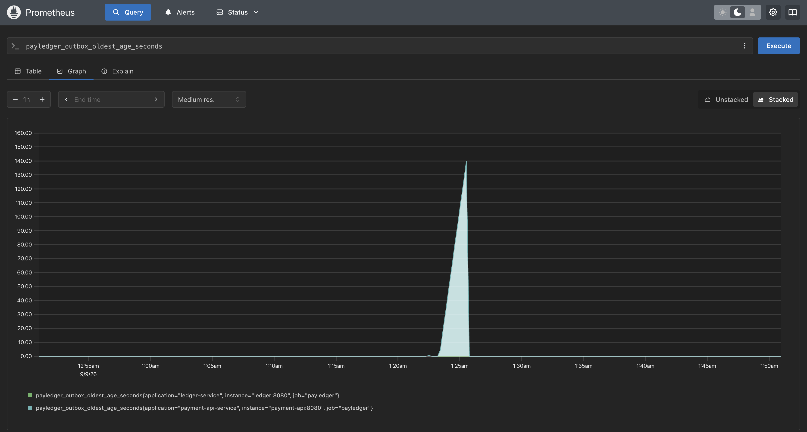

# Failure modes

What breaks when each piece goes down, what happens to money in flight, and what you would see.

The short version: the outbox is what makes most of these survivable. A payment is only ever accepted by writing it and its outgoing message in one database transaction, so anything that fails *after* that point delays the payment rather than losing it.

## The summary table

| What fails | Money at risk | What happens | What you see |
|---|---|---|---|
| Kafka | none | payments are accepted and queue in the outbox | `payledger_outbox_oldest_age_seconds` climbs by 1/second |
| Redis | none | new payments are refused with `500` | `Unhandled exception` in the API log |
| payments-db | none | the API cannot accept anything | requests fail, health check fails |
| ledger-db | none | messages redeliver until it returns | consumer errors, transactions stay `PENDING` |
| ledger-service | none | messages wait on the topic | transactions stay `PENDING`, no ledger logs |
| the outbox poller | none | everything is accepted, nothing is sent | the age gauge climbs, no `Published` lines |
| insights-db or Gemini | none | questions fail | `/insights/ask` errors; payments unaffected |

Nothing in that column says money is at risk, and that is the point of the design rather than a claim of perfection

## Kafka is down

Payments are still accepted. The request path never touches Kafka: it writes the transaction and an `outbox_events` row in one transaction and returns `PENDING`.

The poller keeps failing. `OutboxPublisher.publishBatch()` waits up to `send-timeout` for the broker to accept each record, throws when it does not, and the whole batch rolls back so nothing is marked published and the next tick retries from the top. `OutboxPoller` catches it and logs `Outbox batch failed, retrying on the next poll`, which is deliberately the only signal, because letting the scheduler swallow it would leave no log at all.

When the broker returns, the backlog drains in batches of 100 per second. Nothing is lost, and everything arrives in id order.

**The visible symptom** is `payledger_outbox_oldest_age_seconds` rising by one per second. Zero is healthy. That single number is the only symptom of an outbox that has quietly stopped.



## Redis is down

New payments are refused. The idempotency claim is the first thing `TransactionService` does, and `SETNX` against a dead Redis throws, so the request ends as a `500` from the catch-all handler with the correlation id attached.

That is the intended trade. Redis holds nothing but idempotency keys, so losing it destroys no financial record, but accepting payments without it would mean accepting duplicate charges, which is the one failure this service exists to prevent. Refusing is the safer half of the choice ([ADR-0002](decisions/0002-redis-backed-idempotency-keys.md)).

Payments already in flight are unaffected: settlement runs off Kafka and never touches Redis.

## ledger-service is down

Nothing fails and nothing settles. Messages accumulate on `payment-events`, and because the consumer commits offsets per record rather than automatically, the ledger picks up exactly where it stopped when it returns.

Transactions sit at `PENDING` for as long as it is away. There is **no timeout**, a payment does not expire or auto-fail, it simply waits.

## A database is down

**payments-db**: the API can neither accept nor settle. Requests fail and the container health check goes red, so `docker compose` reports it.

**ledger-db**: the listener throws while applying. The offset is not committed, Kafka redelivers, and it keeps failing until the database returns — at which point the message applies normally. `processed_events` means the redelivery cannot double-apply anything that did land.

## A message is delivered twice

Applied once. Kafka is at-least-once: a producer retry after a lost acknowledgement, or a redelivery after a lost offset commit, puts the same `eventId` through again.

The insert into `processed_events` happens in the same transaction as the work. The second attempt hits the primary key, raises a unique violation, and the whole apply rolls back
([ADR-0005](decisions/0005-processed-events-for-consumer-idempotency.md)). Both listeners catch that specific violation, log `Duplicate delivery of event …, already applied`, and move on.

This is not a rare edge case. A rolled-back outbox batch resends every record that already went out before the failure, so duplicates are the *expected* cost of the retry design.

## The ledger refuses a payment

Not a failure of the system, a decision by it. `CURRENCY_MISMATCH`, `SELF_TRANSFER` or `INSUFFICIENT_FUNDS` produce a `PAYMENT_FAILED` event exactly like a success produces `PAYMENT_COMPLETED`, the transaction moves to `FAILED`, and `failure_reason` records why.

The important part is that a refusal still publishes. Silence would leave the payment `PENDING`forever.

## insights-service is down

Nothing else notices. It reads a copy of the logs and never writes to any payment database, so it cannot affect a payment. A missing `GEMINI_API_KEY` produces a clear error on the first question rather than at startup, and an empty corpus answers `200` with "Nothing has been ingested yet".

## Checking any of this

```bash
docker compose ps                                    # what is actually up
docker compose logs --no-log-prefix | grep <id>      # one payment, both services
```

At `localhost:9090`:

```promql
payledger_outbox_oldest_age_seconds   # climbing = not draining
payledger_outbox_unpublished          # how many are waiting
payledger_ledger_outcome_total        # what the ledger is deciding, by reason
```

[observability.md](observability.md) covers reading these properly.
