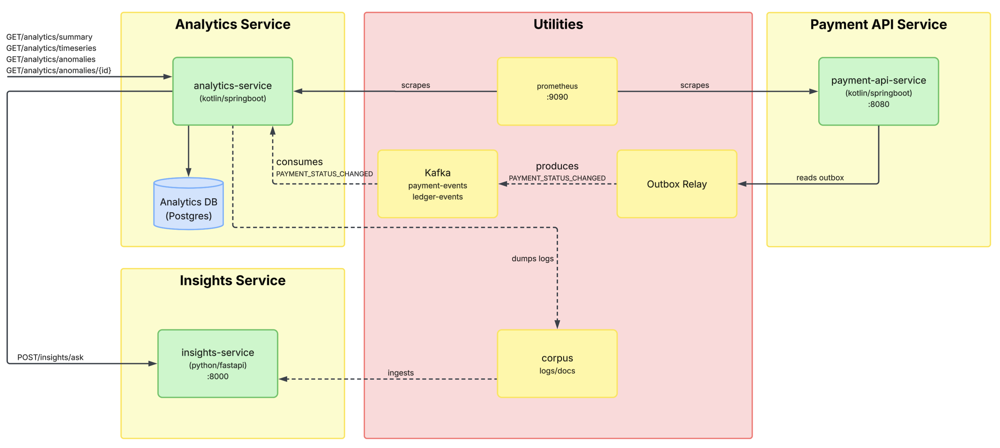

# Payment Analytics
---
## 1. Summary
`analytics-service` consumes the `PAYMENT_STATUS_CHANGED` events that `payment-api-service` already publishes, maintains a running picture of how payments are ending, and raises an *anomaly* when the failure rate jumps well above its own recent baseline. 

On each anomaly it asks `insights-service` why, in plain English, and stores the answer next to the numbers. The end state is that a question like *"failures went from 1.2% to 4.8% at 14:20, what happened?"* is answered by the system rather than by a person grepping logs manually.

No change to how payments are processed. One additive change to the payment event contract.

`analytics-service` is a fourth Kotlin/Spring Boot service with its own Postgres database, following the same shape as `ledger-service`.


## 2. Problem
`TransactionService.settle()` publishes a `PAYMENT_STATUS_CHANGED` event through the transactional outbox onto the `payment-events` topic every time the ledger's verdict lands ([`TransactionService.kt:145`](../../payment-api-service/src/main/kotlin/com/stefan/payment_api_service/transaction/service/TransactionService.kt)).

Meanwhile the only way to learn how the system is doing is `GET /transactions/{id}`, one payment at a time. There is no aggregate view, no failure rate, and no way to notice a problem that affects many payments but no single one catastrophically.

Two gaps in the current event contract block any useful analysis:

| Gap                            | Detail                                                                                                                                                                                                                                                                                                      |
| ------------------------------ | ----------------------------------------------------------------------------------------------------------------------------------------------------------------------------------------------------------------------------------------------------------------------------------------------------------- |
| No failure reason on the event | `Transaction.failureReason` exists as a column (`V8__add_failure_reason.sql`) but was never added to `PaymentEventPayload` ([`PaymentEventDtos.kt:16`](../../payment-api-service/src/main/kotlin/com/stefan/payment_api_service/outbox/model/PaymentEventDtos.kt)). Failures can be counted, not explained. |
| No settled timestamp anywhere  | `transactions` has `created_at` only. Nothing in the system can say how long a payment took to settle.                                                                                                                                                                                                      |

## 3. User Stories
- **US1**: As an engineer running the payments platform, I want the analytics service to just listen to payment outcome events, so that it never touches or slows down how payments actually get processed.
- **US2**: As an engineer investigating the issue, I want a searchable history of payment outcomes that survives restarts, so that can look back at what happened even after a crash or deploy.
- **US3**: As on on-call engineer, I want live failure rate and settlement latency shown as Prometheus metrics, so that I can monitor payment health using the monitoring tools we already have.
- **US4**: As an on-call engineer, I want the system to automatically flag an sustained jump in failures using a simple rule I can check by hand, so that I can trust an alert instead of wondering if a black-box model got it wrong
- **US5**: As an engineer responding to an anomaly, I want a plain  explanation attached automatically, so that I understand what's likely going on without digging through raw numbers myself.
- **US6**: As an engineer researching a recurring problem, I want past anomalies saved into a searchable record, so that I can find and learn from similar incidents later.

## 4. Requirements
### Functional requirements

| ID   | Requirement                                                                                                          |
| ---- | -------------------------------------------------------------------------------------------------------------------- |
| FR1  | Consume `PAYMENT_STATUS_CHANGED` from `payment-events`, ignore other event types.                                    |
| FR2  | Process each event exactly once; a redelivery must not double-count.                                                 |
| FR3  | Persist one fact row per settled payment: status, failure reason, currency, amount, created at, settled at, latency. |
| FR4  | Maintain one-minute rollups so a window query does not scan raw facts.                                               |
| FR5  | Expose failure rate, volume and settlement latency as Micrometer metrics.                                            |
| FR6  | Evaluate the detection rule on a fixed schedule and record an anomaly when it fires.                                 |
| FR7  | On detection, request an explanation from `insights-service` and store it against the anomaly.                       |
| FR8  | Publish an `ANOMALY_DETECTED` event to a dedicated topic.                                                            |
| FR9  | Serve admin-only read endpoints for summary, time series, and anomalies.                                             |
| FR10 | Append closed anomalies to the insights corpus.                                                                      |

### Non-functional

| ID   | Requirement                                                               |
| ---- | ------------------------------------------------------------------------- |
| NFR1 | Analytics being down must not affect `payment-api` or `ledger` in any way |
| NFR2 | Ingestion lag under normal load                                           |
| NFR3 | Read endpoint latency                                                     |
| NFR4 | Restart safety                                                            |
| NFR5 | An insights failure degrades the explanation, never the anomaly           |
| NFR6 | A first start replays retained history without special tooling            |

---
## 5. Detailed design
### 5.1 Data model

```sql
CREATE TABLE payment_facts (
    transaction_id   UUID PRIMARY KEY,
    status           TEXT        NOT NULL,          -- COMPLETED | FAILED
    failure_reason   TEXT,                          -- NULL when COMPLETED
    currency         CHAR(3)     NOT NULL,
    amount           NUMERIC(19,4) NOT NULL,
    amount_band      TEXT        NOT NULL,          -- derived: SMALL | MEDIUM | LARGE
    created_at       TIMESTAMPTZ NOT NULL,
    settled_at       TIMESTAMPTZ NOT NULL,
    latency_ms       BIGINT      NOT NULL
);
CREATE INDEX payment_facts_settled_at_idx ON payment_facts (settled_at);

CREATE TABLE payment_buckets (
    bucket_start     TIMESTAMPTZ NOT NULL,          -- truncated to the minute
    status           TEXT        NOT NULL,
    failure_reason   TEXT        NOT NULL DEFAULT 'NONE',
    currency         CHAR(3)     NOT NULL,
    count            BIGINT      NOT NULL,
    amount_total     NUMERIC(19,4) NOT NULL,
    latency_total_ms BIGINT      NOT NULL,
    PRIMARY KEY (bucket_start, status, failure_reason, currency)
);

CREATE TABLE anomalies (
    id               BIGSERIAL PRIMARY KEY,
    detected_at      TIMESTAMPTZ NOT NULL,
    closed_at        TIMESTAMPTZ,
    state            TEXT        NOT NULL,          -- OPEN | CLOSED
    window_start     TIMESTAMPTZ NOT NULL,
    window_end       TIMESTAMPTZ NOT NULL,
    baseline_rate    NUMERIC(6,4) NOT NULL,
    observed_rate    NUMERIC(6,4) NOT NULL,
    settled_count    BIGINT      NOT NULL,
    failed_count     BIGINT      NOT NULL,
    top_breakdown    JSONB       NOT NULL,          -- [{"reason":"INSUFFICIENT_FUNDS","share":0.82}, ...]
    insight_status   TEXT        NOT NULL,          -- PENDING | READY | FAILED
    insight_answer   TEXT,
    insight_sources  JSONB
);
```

Plus `processed_events` and `outbox_events`, copied unchanged from the existing services.
### 5.2 Anomaly detection
The rule watches the failure rate over a short recent window (say, the last 10 minutes) and compares it to a longer baseline window (say, the last hour). If the recent rate is a fixed amount higher for long enough, it flags an anomaly.

```
every 60 seconds:
    recent   = failure rate over the last 15 minutes
    baseline = failure rate over the 24 hours preceding that window

    FIRE when
        recent   >= baseline * 3            (multiplier)
    and recent   >= 0.02                    (absolute floor)
    and recent   window has >= 20  settled  (recent sample minimum)
    and baseline window has >= 200 settled  (baseline sample minimum)
    and no anomaly is currently OPEN

    CLOSE an OPEN anomaly when
        recent < baseline * 1.5 for 2 consecutive evaluations
```

---
## 6. API

All endpoints require the existing JWT with `ROLE_ADMIN`, consistent with `PATCH /transactions/{id}/status`. Service runs on container port 8080, published on host port 8081.

| Method | Path | Purpose |
|---|---|---|
| GET | `/analytics/summary?window=1h` | Current rate, volume, breakdown |
| GET | `/analytics/timeseries?from&to&interval` | Bucketed series for charting |
| GET | `/analytics/anomalies?state=&limit=` | Episodes, newest first |
| GET | `/analytics/anomalies/{id}` | One episode with its explanation |

```jsonc
// GET /analytics/summary?window=1h
{
  "windowStart": "2026-09-10T13:20:00Z",
  "windowEnd":   "2026-09-10T14:20:00Z",
  "settled": 4182,
  "failed": 201,
  "failureRate": 0.0481,
  "p95SettlementLatencyMs": 1840,
  "byReason": [
    { "reason": "INSUFFICIENT_FUNDS", "count": 165, "share": 0.8209 },
    { "reason": "CURRENCY_MISMATCH",  "count":  28, "share": 0.1393 },
    { "reason": "SELF_TRANSFER",      "count":   8, "share": 0.0398 }
  ],
  "byCurrency": [ { "currency": "AUD", "count": 172, "share": 0.8557 } ]
}
```

```jsonc
// GET /analytics/anomalies/{id}
{
  "id": 7,
  "state": "OPEN",
  "detectedAt": "2026-09-10T14:35:00Z",
  "windowStart": "2026-09-10T14:20:00Z",
  "windowEnd": "2026-09-10T14:35:00Z",
  "baselineRate": 0.0121,
  "observedRate": 0.0481,
  "settledCount": 623,
  "failedCount": 30,
  "topBreakdown": [ { "reason": "INSUFFICIENT_FUNDS", "share": 0.82 } ],
  "insightStatus": "READY",
  "insightAnswer": "Ledger rejections for insufficient funds begin at 14:21 ...",
  "insightSources": [
    { "citationNumber": 1, "sourceRef": "docs/failure-modes.md", "sourceType": "DOC" },
    { "citationNumber": 2, "sourceRef": "demo-8814", "sourceType": "LOG" }
  ]
}
```

---
## Done when
- If you trigger a fake failure spike, the system should raise exactly one anomaly, you should be able to see it through the API and on the Prometheus graph, with an explanation attached.
- Be able to explain why building this service didn't require touching `ledger-service` all all, and why using a second consumer group on the same topic is better than using a queue
