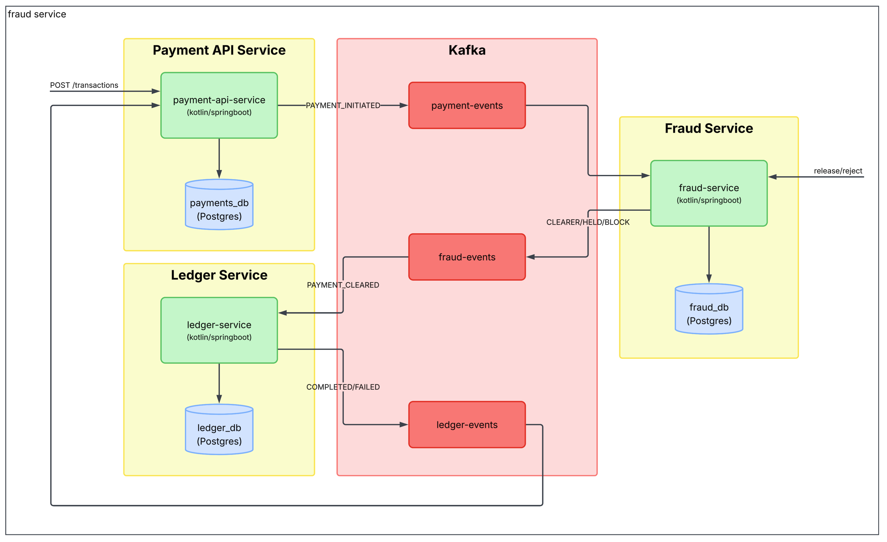
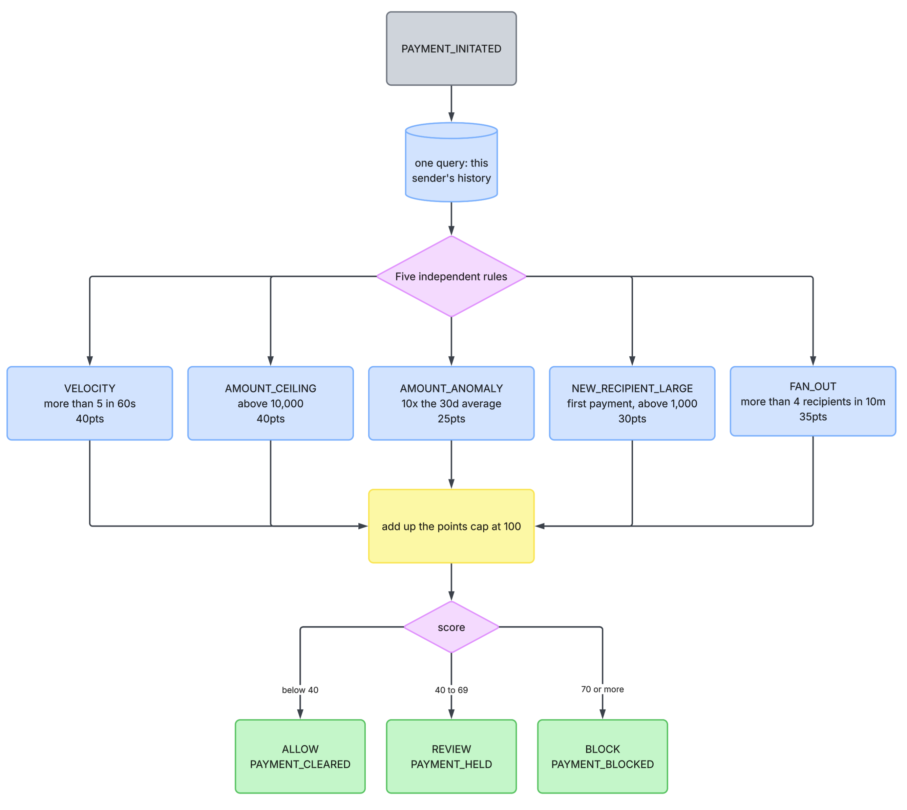
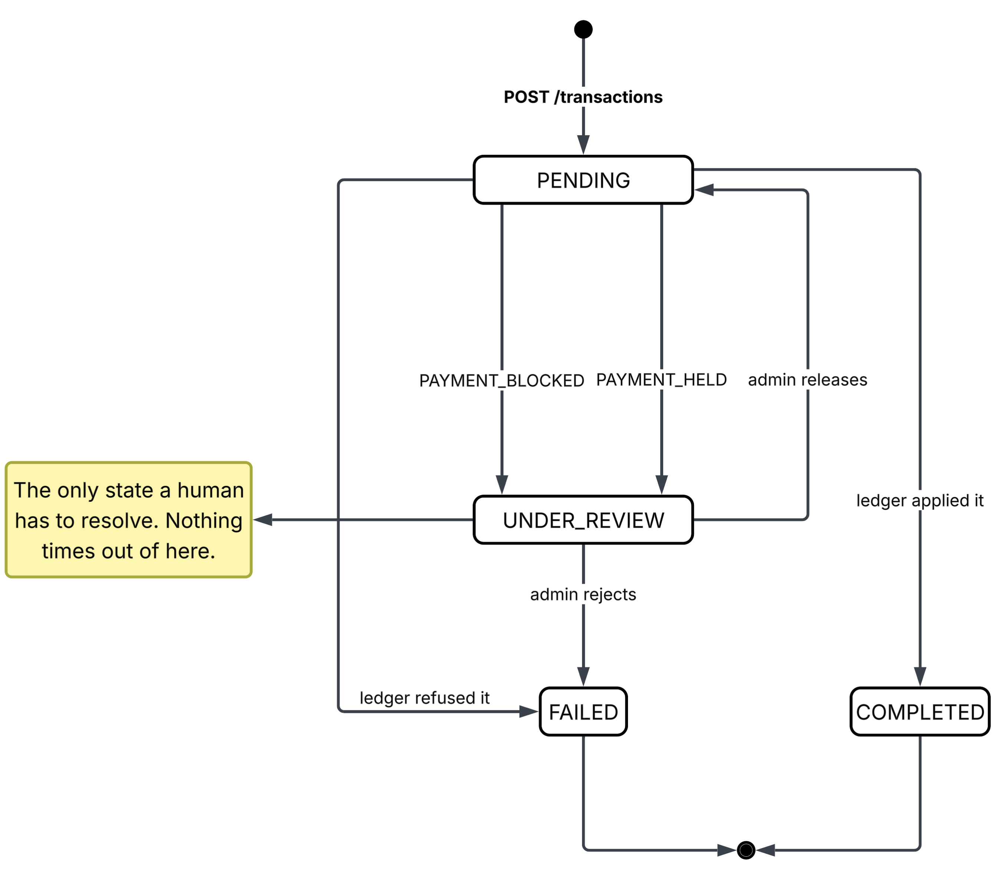

# Fraud Screening

---

## 1. Summary

`fraud-service` looks at every payment before the ledger moves any money, and decides one of three things: let it through, hold it for a person to look at, or refuse it.

It decides using five plain rules: 
- how fast this sender is paying
- how large the amount is
- how it compares to what they normally send, whether the recipient is new,  
- how many different people they are paying.  

Each rule that fires adds a number. The numbers are added up, and the total decides the outcome.

No model, no training, no learning. When a payment is held you can say exactly which rules fired and what the numbers were.

`fraud-service` sits in the middle of the pipeline rather than off to one side. `payment-api-service` does not call it and does not know it exists — it publishes a payment exactly as it always did. What changed is that `ledger-service` now waits for a payment that has been *cleared*, instead of one that has merely been *asked for*.

The dotted arrows are events coming back. Nothing here calls anything.

---

## 2. Problem

Before this, a payment passed three checks: you are not paying yourself, the recipient exists, and the request is well-formed. After that the ledger only asked one more question, can this account afford it?

Nobody asked whether the payment *looked wrong*. All of these went straight through:

- one account sending twenty payments a minute
- a first-ever payment of $50,000 to someone never paid before
- one account paying fifteen different people in ten minutes

Each one is individually affordable and individually valid. The problem is the shape of them together, and nothing in the system was looking at shape.

There was also no record to look back at. `GET /transactions/{id}` tells you about one payment. There was no way to ask what a sender had been doing, which is the only question that makes any of the patterns above visible.

---

## 3. The rules

Five rules. Each looks at one thing, and each is worth a fixed number of points. A payment's score is the total of every rule that fired, capped at 100.

| Rule | Fires when | Points |
|---|---|---|
| `VELOCITY` | more than 5 payments from this sender in 60 seconds | 40 |
| `AMOUNT_CEILING` | the amount is above 10,000 | 40 |
| `AMOUNT_ANOMALY` | the amount is more than 10x this sender's 30-day average | 25 |
| `NEW_RECIPIENT_LARGE` | first ever payment to this recipient, and above 1,000 | 30 |
| `FAN_OUT` | more than 4 different recipients from this sender in 10 minutes | 35 |

A score below 40 is allowed. From 40 to 69 the payment is held for review. At 70 or above it is refused outright.



Every number above lives in `application.yml` and can be changed without touching code.

---

## 4. Why those numbers

The points are chosen so that **no single rule can refuse a payment on its own**, and so the combinations that do reach 70 are the ones that look like an account being emptied.

| What fired | Score | Outcome | Why that is right |
|---|---|---|---|
| `NEW_RECIPIENT_LARGE` alone | 30 | allowed | Buying a car looks exactly like this |
| `VELOCITY` alone | 40 | held | Might be a stuck retry button. Might not be |
| `AMOUNT_ANOMALY` + `NEW_RECIPIENT_LARGE` | 55 | held | Unusual size *and* someone never paid before |
| `NEW_RECIPIENT_LARGE` + `AMOUNT_CEILING` | 70 | refused | A very large first payment to a stranger |
| `VELOCITY` + `FAN_OUT` | 75 | refused | Fast *and* scattered: the account-drain pattern |

The last row is the one the whole design is aimed at. Speed alone is ambiguous, paying your landlord six times is someone hitting a button too often. Spread alone is ambiguous too. Together they are somebody moving money out of an account as fast as they can to as many places as they can, and that is worth refusing without waiting for a human.

---

## 5. What happens to a payment

A held or refused payment never reaches the ledger, so no money moves. The client is not told anything different at the time — `POST /transactions` still answers `PENDING` immediately, exactly as before, and the real outcome arrives a moment later. That is already how this system works: the ledger's verdict has always arrived after the response.


A refused payment becomes `FAILED` with the reason `FRAUD_BLOCKED`, the same way a payment the ledger cannot afford becomes `FAILED` with `INSUFFICIENT_FUNDS`. There is no separate "blocked" status, because a refused payment did not happen and there is a reason why — which is what the reason field is for.

`UNDER_REVIEW` is the only new state, and the only one that waits on a person.

---

## 6. Reviewing a held payment

An admin can see every decision and overturn the held ones. These endpoints need an admin token, and live on `fraud-service` rather than the payments API, because the service that made the decision is the one that owns changing it.

| Method | Path | What it does |
|---|---|---|
| GET | `/fraud/decisions?decision=REVIEW` | the review queue |
| GET | `/fraud/decisions/{transactionId}` | one decision and the rules that fired |
| POST | `/fraud/decisions/{transactionId}/release` | let it through |
| POST | `/fraud/decisions/{transactionId}/reject` | refuse it |

Releasing publishes exactly the same message a clean payment produces. The ledger cannot tell a released payment from one that was never held, and needs no special handling for reviewed payments at all.

Both actions refuse to run twice. A second release returns `409`, because two "cleared" messages for one payment would carry two different ids, the ledger would treat them as two different events, and it would move the money twice.

Nothing expires. A held payment waits until somebody looks at it.

---

## 7. Why it is a gate, not a phone call

The obvious design is for `payment-api-service` to call `fraud-service` and wait for an answer. That was rejected.

Calling would mean the front door cannot accept a payment unless a second service is up and answering within a deadline. That is a kind of coupling this system does not have anywhere else — `ledger-service` has no public API at all, and nothing waits on it.

Putting the screening in the pipeline instead means:

- `payment-api-service` is unchanged, and never learns fraud screening exists
- if `fraud-service` is down, payments are still accepted and simply wait on the topic, then clear when it comes back. There is no timeout to design and no "what if it is slow" policy to write
- screening sees every payment in order, so counting how many a sender has made is exact rather than an estimate from a lagging copy

The cost is honest: settlement takes about twice as long, because there is one more store-and-forward hop. A cleared payment still settles in a few seconds.

The other cost is that `ledger-service` had to change, but only by two lines. See [ADR-0020](../decisions/0020-reuse-the-payment-envelope-so-the-ledger-barely-changes.md).

---

## 8. Asking why a payment was blocked

There is no connection between `fraud-service` and `insights-service`. Asking *"why was this payment blocked?"* works the way every other question about a payment works: you ask `insights-service`, and it answers from the logs.

That works because every decision is written to the log as a readable sentence:

```
Screened as BLOCK, score 70/100, rules: AMOUNT_CEILING (500000 AUD over 10000),
NEW_RECIPIENT_LARGE (first to this recipient, 500000 AUD)
```

Everything a person needs is inside that one line, on purpose. The log reader groups lines by the id a payment travels under, and keeps only the message text, so a number stored anywhere else would never reach the answer.

The same id is carried from the moment the payment is accepted, through screening, into the ledger, and back. An admin releasing a held payment logs under that original id too, so "held at 14:32" and "released at 14:41" stay part of one story rather than two unrelated ones.

The corpus is rebuilt by hand, so a payment made since the last rebuild is invisible to it. See [insights-retrieval.md](insights-retrieval.md).
