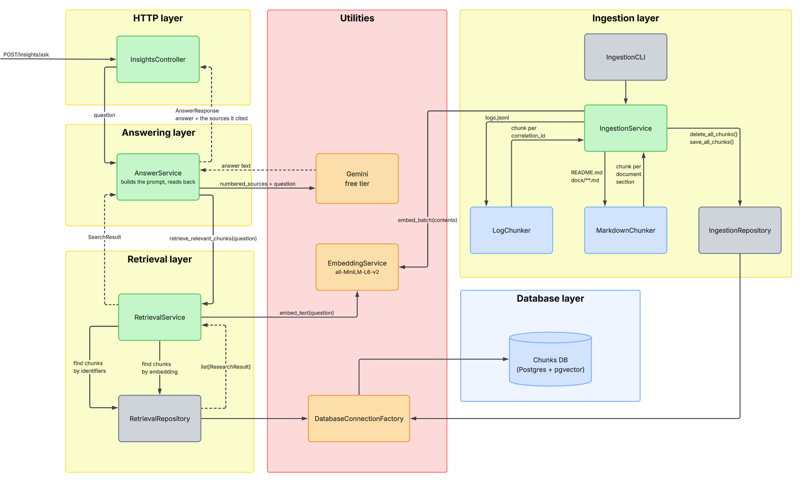
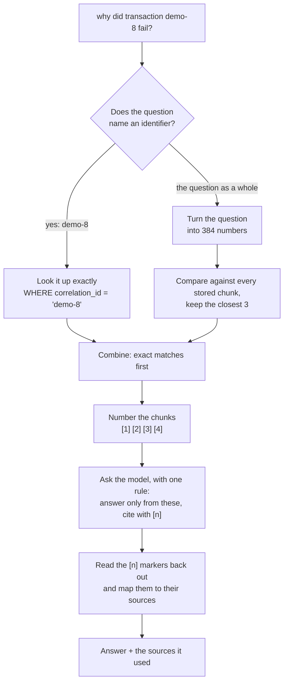

# Insights Retrieval
---
## 1. Summary
`insights-service` turns a question in plain English into an answer drawn from this project's own logs and documents, with the sources it used cited alongside it.

This is the companion to [observability.md](observability.md). That one answers *what happened to this payment* by hand, with `grep`. This one answers the same question by asking, and adds a second one, *why is the system built this way*, from the documents in this repository.

The technique in one line: a language model can only answer from what it is shown, and everything will not fit, so the service searches first and shows it only what won. The searching is where nearly all the difficulty lives; asking the model is the easy part at the end.

The reasoning behind each choice is in [ADR-0014](decisions/0014-python-for-the-insights-service.md) through [ADR-0018](decisions/0018-a-free-model-writes-the-answers.md).



Two paths run through the same components. A question comes down the left — controller, answering, retrieval, store — and the answer comes back up the same way. Ingestion runs on its own, by hand, and only ever meets the question path at two points: the embedding model, and the `chunks` table.

That the embedding model is one shared instance is the point of the shared layer: the same model that turned a document into numbers has to turn the question into numbers, or the two would not be comparable. Each feature keeps its own repository even though both touch one table — writes change when the shape of a chunk changes, reads change when search changes.

## 2. Problem
`observability.md` covers finding out what happened to one payment by hand. Two gaps remain beyond that:

| Gap                                   | Detail                                                                                                                                                                                                      |
| ------------------------------------- | ----------------------------------------------------------------------------------------------------------------------------------------------------------------------------------------------------------- |
| No plain-English "why"                | Answering *"failures went from 1.2% to 4.8% at 14:20, what happened?"* today means an engineer manually greps logs and cross-references docs. Nothing in the system does this for them.                     |
| No searchable record of design intent | Questions like *"why optimistic locking?"* or *"why not pessimistic locking?"* can only be answered by knowing which ADR to open and reading it. There is no way to ask and be pointed at the right source. |

Two properties of the underlying data make a naive approach to this fail:

| Property                                                               | Consequence                                                                                                                                                                                                                                                                                                                                                                                                                  |
| ---------------------------------------------------------------------- | ---------------------------------------------------------------------------------------------------------------------------------------------------------------------------------------------------------------------------------------------------------------------------------------------------------------------------------------------------------------------------------------------------------------------------- |
| Most useful text shares no vocabulary with the question asked about it | A semantic search is needed, plain keyword matching would miss it.                                                                                                                                                                                                                                                                                                                                                           |
| Some questions name a specific identifier (e.g. a correlation id)      | An identifier has no semantic meaning of its own, embedding it and comparing by similarity measures how the string happens to be chopped up, not relatedness. An identifier-naming question needs an exact lookup, not a meaning-based one, or it risks a fluent, confident, wrong answer about a different payment with nothing wrong on the surface. See [ADR-0017](decisions/0017-two-kinds-of-search-instead-of-one.md). |

## 3. User Stories
- **US1**: As an engineer investigating an incident, I want to ask a question in plain English and get an answer, so that I don't have to grep logs manually.
- **US2**: As an engineer researching a design decision, I want to ask "why is X built this way" and get an answer drawn from this project's own documents and ADRs, so that I don't have to know which doc to open.
- **US3**: As an engineer asking about one specific payment, I want a question naming its identifier resolved by an exact lookup rather than a fuzzy match, so that I don't get a confident answer about the wrong payment.
- **US4**: As an engineer reading an answer, I want the sources it drew from shown alongside it, so that I can verify what it says rather than take it on faith.
- **US5**: As an engineer relying on this service, I want to be able to tell whether a result came from the exact lookup or the meaning-based search, so that a silent collapse to only one search path is visible rather than merely suspected.
- **US6**: As an engineer maintaining this service, I want a manual step that rebuilds the searchable corpus from the current logs and documents, so that I can refresh it after new payments happen or documents change.

## 4. Requirements
### Functional requirements

| ID   | Requirement                                                                                                                                    |
| ---- | ---------------------------------------------------------------------------------------------------------------------------------------------- |
| FR1  | Accept a natural-language question and return an answer with the sources it drew from.                                                         |
| FR2  | Detect identifiers named in the question (e.g. a correlation id) and resolve them by an exact lookup against indexed columns.                  |
| FR3  | Turn the non-identifier part of the question into an embedding and run a similarity search against stored chunks, keeping the closest matches. |
| FR4  | Combine results from both searches for a single question, with exact matches ordered first.                                                    |
| FR5  | Number the combined chunks and pass them to the model with the constraint that it answer only from what's shown and cite with `[n]`.           |
| FR6  | Parse the `[n]` markers back out of the model's answer and map each one to its source chunk.                                                   |
| FR7  | Record, per result, which of the two searches found it.                                                                                        |
| FR8  | Break log lines into chunks grouped by correlation id, one chunk per payment's whole journey across services.                                  |
| FR9  | Split documents into chunks at `##` and `####` headings.                                                                                       |
| FR10 | During ingestion, flag any chunk that exceeds the embedding model's input limit (currently truncated silently by the model otherwise).         |
| FR11 | Provide a manual re-ingestion step that empties and rebuilds the chunk store from a fresh log export and the current documents.                |

### Non-functional

| ID   | Requirement                                                                                                                                                                                                                                            |
| ---- | ------------------------------------------------------------------------------------------------------------------------------------------------------------------------------------------------------------------------------------------------------ |
| NFR1 | The corpus is refreshed only by the manual re-ingestion step; there is no automatic ingestion, and this must not be hidden from whoever asks a question.                                                                                               |
| NFR2 | Citations are the model's own claim about provenance and are not independently verified; correctness depends on the reader checking the cited source.                                                                                                  |
| NFR3 | The query endpoint requires no authentication, unlike every payments endpoint — acceptable only because the service and its data are local and non-sensitive.                                                                                          |
| NFR4 | The embedding similarity search is a full scan with no index, acceptable at current corpus size; revisit as the corpus approaches roughly a million chunks ([ADR-0015](decisions/0015-search-in-postgres-rather-than-a-dedicated-search-database.md)). |
| NFR5 | No re-ranking or keyword-blended scoring is performed; both are considered unnecessary at the current scale.                                                                                                                                           |

---
## 5. Detailed design

### 5.1 Data model
One table, created once when the database volume is first made ([`infra/insights-db/init.sql`](../../infra/insights-db/init.sql)). There are no migrations, because ingestion empties and rebuilds the table on every run — there is never any data in here worth migrating.

```sql
CREATE EXTENSION IF NOT EXISTS vector;

CREATE TABLE chunks (
    id             BIGSERIAL PRIMARY KEY,
    source_type    TEXT NOT NULL,        -- 'LOG' or 'DOC'
    source_ref     TEXT NOT NULL,        -- what gets cited back to the reader
    correlation_id TEXT,                 -- logs only, null for docs
    transaction_id TEXT,                 -- logs only, null for docs
    content        TEXT NOT NULL,        -- the text that was embedded
    embedding      vector(384) NOT NULL
);

CREATE INDEX chunks_correlation_id_idx ON chunks (correlation_id);
CREATE INDEX chunks_transaction_id_idx ON chunks (transaction_id);
```

| Column                          | What it holds                                                                                                                                                                                    |
| ------------------------------- | ------------------------------------------------------------------------------------------------------------------------------------------------------------------------------------------------ |
| `source_type`                   | `LOG` or `DOC`. Set by whichever chunker produced the row and returned to the caller with each citation.                                                                                          |
| `source_ref`                    | The citation itself. A document chunk gets `docs/path/file.md — Section / Subsection`; a log chunk gets `correlation id demo-8`.                                                                  |
| `correlation_id`                | Filled for log chunks only, and the thing the exact lookup matches on.                                                                                                                            |
| `transaction_id`                | Filled for log chunks only, when any line in the flow carried one. Also matched by the exact lookup, so a question naming either id finds the payment.                                            |
| `content`                       | The embedded text, prefixed with where it came from — `From docs/... (Title), section '...':` for documents, `Log flow for correlation id ...` for logs. The prefix is embedded along with the body so a section still matches its document's subject when the body never names it. |
| `embedding`                     | 384 numbers from `all-MiniLM-L6-v2`, normalised, compared with pgvector's `<=>` cosine distance.                                                                                                 |

Both indexes exist for the same reason: the exact lookup is a plain equality match on an identifier, and it is the path that must not be slow or approximate ([ADR-0017](decisions/0017-two-kinds-of-search-instead-of-one.md)).

**What is deliberately not in this table:**

- **No index on `embedding`.** Every question scans all rows. Fine at this size, revisit near a million chunks (NFR4).
- **No record of which search found a result.** FR7 is met at the response, not in the schema: `SearchResult.search_strategy` is set to `EXACT` or `SEMANTIC` by whichever repository method returned the row, and is never written down.
- **No ingest timestamp.** Nothing records when the table was last rebuilt, so §5.6's advice to check the ingest date means checking when *you* last ran the command. There is no column to read it from.
- **No chunk-to-document relationship.** A chunk carries its `source_ref` string and nothing else; documents are not modelled.

203 chunks at the time of writing — 190 from documents, 13 from logs, one per correlation id.

### 5.2 Concepts
Nothing else in PayLedger uses these terms, so they're worth defining up front.

**Turning text into numbers.** A small model reads a piece of text and produces a list of 384 numbers standing for what it says. Text about the same subject produces similar lists, even with no words in common. This is the only reason a search can find "why not pessimistic locking" inside a document that never uses that phrase.

**Distance.** Two lists are compared by how far apart they point, on a scale where 0 means identical and 2 means opposite. In practice, anything under about 0.6 is a real match and anything above 0.8 is unrelated. Sorting by that distance and keeping the closest few *is* the search.

**A chunk.** One searchable piece of text, stored with its numbers. Everything is broken into chunks before being stored, because a whole document is too coarse to be a useful answer and a single line is too small to mean anything.

### 5.3 Retrieval flow



Two searches run for every question, and either can come back empty. A question naming no identifier gets nothing from the exact lookup, which is the normal case for a design question.

### 5.4 Why two searches instead of one
Because a name has no meaning. "Why optimistic locking?" can be found by comparing meanings — that is exactly what the numbers are for. But `demo-8` is a label: turning it into numbers produces a list with no significance, and comparing it against `demo-7` measures how the two strings happen to be chopped up, not whether they are related.

The failure that causes is the quiet kind: ask about one payment, get a fluent and confident answer about a different one, with nothing wrong on the surface. So identifiers are pulled out of the question with a pattern and looked up exactly against indexed columns, and only the rest goes through the meaning-based search. Every result records which of the two found it, so a silent collapse back to one search is visible rather than merely suspected. Full argument: [ADR-0017](decisions/0017-two-kinds-of-search-instead-of-one.md).

### 5.5 Chunking
**Logs are grouped by correlation id.** One payment's whole journey across both services, four to six lines, becomes one chunk. The id is a natural boundary, and it is the right one: a chunk spanning two payments matches both questions and answers neither.

**Documents are split at their headings**, at both `##` and `####`. The second level matters for two reasons: the embedding model stops reading after roughly 190 English words and says nothing about it, so a long section would lose its tail invisibly; and the ADRs use `####` for *Option A / Option B / Option C*, so splitting there makes each alternative separately findable — "why not pessimistic locking" matches one option rather than competing with two others in the same block.

Ten chunks currently exceed the limit. Ingestion prints a `!` line for each one, which is the only warning that part of a document is unsearchable.

### 5.6 Re-ingestion
The logs only exist on the containers' output, and `docker compose down` loses them. So the corpus is a snapshot, taken by hand:

```bash
docker compose logs --no-log-prefix > insights-service/data/logs.jsonl
docker compose exec insights python -m app.ingestion.ingestion_cli
```

`--no-log-prefix` is not optional — without it Docker puts `ledger-1  | ` in front of every line and none of it parses.

Ingestion empties the table and rebuilds it from scratch each time. Nothing triggers it, so **payments made after the last dump are invisible, and the service cannot tell you that**. If an answer about a recent payment looks wrong, check the ingest date before anything else.

### 5.7 Deliberate non-goals
- **No automatic ingestion.** Nothing watches for new payments or edited documents. Re-running it is a manual step, and the service will happily answer from a stale corpus without mentioning it.
- **No enforced citations.** The `[n]` markers are the model's own claims about where something came from. It can attribute a sentence to source 2 that source 2 does not support, and the answer will look identical to a correct one. Reading the source alongside the answer is the only check. See [ADR-0018](decisions/0018-a-free-model-writes-the-answers.md).
- **No login on the endpoint**, unlike every payments endpoint. Acceptable only because it is local and there is nothing sensitive behind it.
- **No index on the stored numbers.** At a thousand chunks, checking every row is faster than maintaining one. That stops being true somewhere around a million ([ADR-0015](decisions/0015-search-in-postgres-rather-than-a-dedicated-search-database.md)).
- **No re-ranking, and no keyword scoring blended with the meaning-based search.** Both are standard next steps, and both are unnecessary at this size.

---
## 6. API

Base URL `http://localhost:8000`. No authentication on either endpoint, unlike every payments endpoint — see NFR3 and §5.7. FastAPI serves its generated documentation at `/docs` and the schema at `/openapi.json`.

| Method | Path             | Purpose                                                        |
| ------ | ---------------- | -------------------------------------------------------------- |
| POST   | `/insights/ask`  | Ask a plain-English question, get an answer with cited sources |
| GET    | `/health`        | Returns `{"status": "up"}`; used by the compose healthcheck    |

Field names are snake_case here, where the Kotlin services use camelCase. Nothing translates between the two, so a caller written against the payments API will not find `citedSources` on this response.

```jsonc
// POST /insights/ask
{ "question": "why did transaction demo-8 fail?" }
```

```jsonc
// 200 OK
{
  "answer": "demo-8 was rejected by the ledger for insufficient funds [1]. The debit account held less than the transfer amount at the time the ledger checked [1], which is the rejection path described in [2].",
  "cited_sources": [
    { "citation_number": 1, "source_ref": "correlation id demo-8", "source_type": "LOG" },
    { "citation_number": 2, "source_ref": "docs/features/observability.md — Following one payment", "source_type": "DOC" }
  ]
}
```

At most four chunks reach the model: every exact match on an identifier named in the question, plus the closest three by meaning (`TOP_K`), with anything already found by the exact lookup excluded so it cannot appear twice.

`cited_sources` reports only the chunks the model actually referenced with an `[n]` marker — in ascending order, de-duplicated, and with any marker pointing past the end of the source list dropped. A chunk that was retrieved and shown to the model but never cited does not appear. This is a report of what the model *claimed* to use; nothing verifies it (NFR2).

Two replies that read like failures but come back as `200`:

| Situation                                | Response                                                                      |
| ---------------------------------------- | ----------------------------------------------------------------------------- |
| The corpus is empty, nothing ingested yet | `"answer": "Nothing has been ingested yet."` with `cited_sources` empty       |
| The model returned no text                | `"answer": "No answer was generated."`                                        |

There is no error model beyond that. A missing `GEMINI_API_KEY` raises on the first question asked and surfaces as a `500`; a body without a `question` field is rejected by FastAPI's own validation as a `422`.

Two things run as commands rather than endpoints, both from the `insights-service` directory:

```bash
python -m app.ingestion.ingestion_cli    # rebuild the corpus (§5.6)
python -m app.retrieval.evaluation_cli   # score retrieval against eval/questions.json
```

---
## Done when
- Asking a question that names a payment's identifier (e.g. `demo-8`) returns an answer built from an exact lookup on that payment, not a similarity match against a different one.
- Asking a design question (e.g. "why optimistic locking?") returns an answer citing the relevant ADR section, not just the whole document.
- Every returned answer lists the sources it cited, and each citation can be traced back to a real stored chunk.
- Running the re-ingestion command after `docker compose logs --no-log-prefix > ...` rebuilds the corpus from scratch and the chunk counts reflect the current logs and docs.
- Be able to explain why an identifier-naming question needs a different search path than a meaning-based one, and why that failure mode is otherwise silent.
