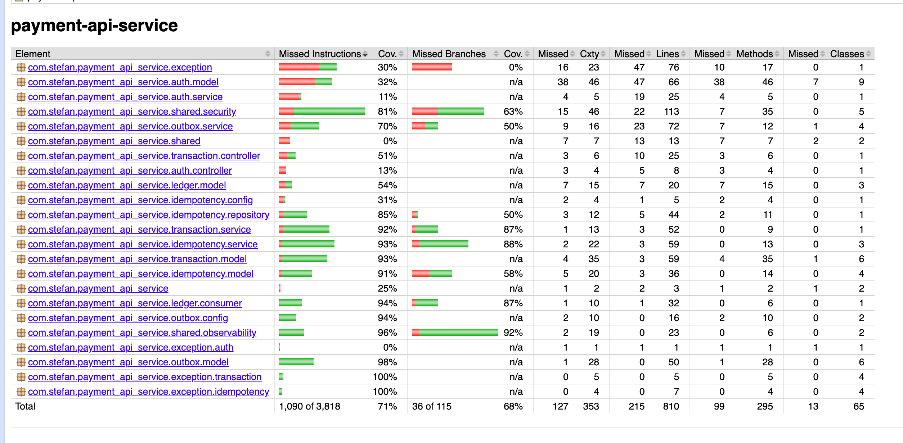
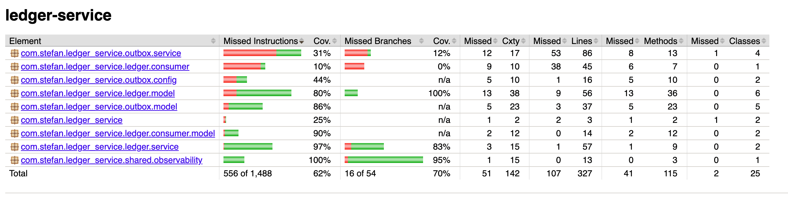

# Testing

What is tested, how to run it, and which parts are deliberately left uncovered.

Both Kotlin services use JUnit 5. Anything that touches a database or a queue runs against a real one in a container rather than a fake, so the tests fail for the same reasons production would.

## Running them

```bash
cd payment-api-service && ./gradlew test     # or cd ledger-service
```

Docker has to be running, most of these tests start a Postgres or a Kafka. A coverage report is written automatically after every run:

```
build/reports/jacoco/test/html/index.html
```

Latency benchmarks are excluded from the normal run, because they measure timing rather than correctness and are slow. Opt in:

```bash
./gradlew benchmark
```

## What each test is for

**payment-api-service**

| Test | What it proves |
|---|---|
| `TransactionServiceTests` | validation and status rules, without a database |
| `PostgresIntegrationTests` | the schema, the constraints, and optimistic locking really behave |
| `IdempotencyServiceTests` | the state machine: claim, replay, deterministic failure, ambiguous hold |
| `IdempotencyIntegrationTests` | the same against a real Redis |
| `ConcurrentRetryTests` | two identical requests at once produce one payment |
| `ClientErrorRegistryTests` | a stored rejection can be rebuilt and replayed as the same error |
| `OutboxAtomicityTests` | the payment and its outbox row commit together or not at all |
| `OutboxIntegrationTests` | the poller picks rows up, sends them, and marks them sent |
| `OutboxPublisherTests`, `PaymentEventPublisherTests` | the message shape and topic |
| `SettlementIntegrationTests` | a ledger verdict flips `PENDING` to `COMPLETED` or `FAILED` |
| `LedgerVerdictContractTests` | this service can still read what the ledger sends |
| `JwtUtilityTests` | signing, expiry, and rejecting a tampered token |
| `LogContextTests` | the correlation id reaches the log line |
| `IdempotencyOverheadBenchmark` | what idempotency costs per request (tagged `benchmark`) |

**ledger-service**

| Test | What it proves |
|---|---|
| `LedgerServiceIntegrationTests` | funds checks, double-entry, balances, and refusal reasons |
| `AccountTests` | how a debit or credit moves an `ASSET` versus a `LIABILITY` |
| `LedgerVerdictContractTests` | this service still sends what the API expects |
| `LogContextTests` | the correlation id survives the Kafka hop |

## The contract pair

The two services never run together in one test. They have files with the same names in the same packages, so they cannot start inside a single JVM, and running them as two separate programs cost far more setup than it proved
([ADR-0010](decisions/0010-contract-pair-instead-of-end-to-end-tests.md)).

Instead there is one example message, saved as the same file in both services:

```
src/test/resources/contract/ledger-verdict.json
```

- The **ledger** runs a real payment and checks the message it produced still matches the file.
- The **API** takes that file, sends it through a real Kafka, and checks the payment settles.

Change the message format on either side and one of the two tests fails. The catch is that the file is duplicated: editing one copy and not the other makes both tests pass while the services disagree.

## Coverage

Measured with JaCoCo, written after every `./gradlew test`.

| Service             | Instructions | Branches |
| ------------------- | ------------ | -------- |
| payment-api-service | 71%          | 68%      |
| ledger-service      | 62%          | 70%      |





The totals matter less than their shape. The code that decides what happens to money is the well covered part:

| Package | Covered |
|---|---|
| `ledger.service` (ledger) | 97% |
| `ledger.consumer` (API) | 94% |
| `idempotency.service` | 93% |
| `transaction.service` | 92% |
| `shared.observability` | 96% / 100% |

What drags the totals down is wiring rather than logic: controllers, config classes, DTOs and exception types, where a test would mostly assert that a constructor assigns its arguments.

## What is deliberately not tested

- **No end-to-end test.** Nothing starts both services and drives them like a user would. The contract pair is the substitute, and it does not prove the two run correctly together only that they agree about the message.
- **No load test in the suite.** `payment-api-service/load-test/` is a separate k6 run, started by hand.
